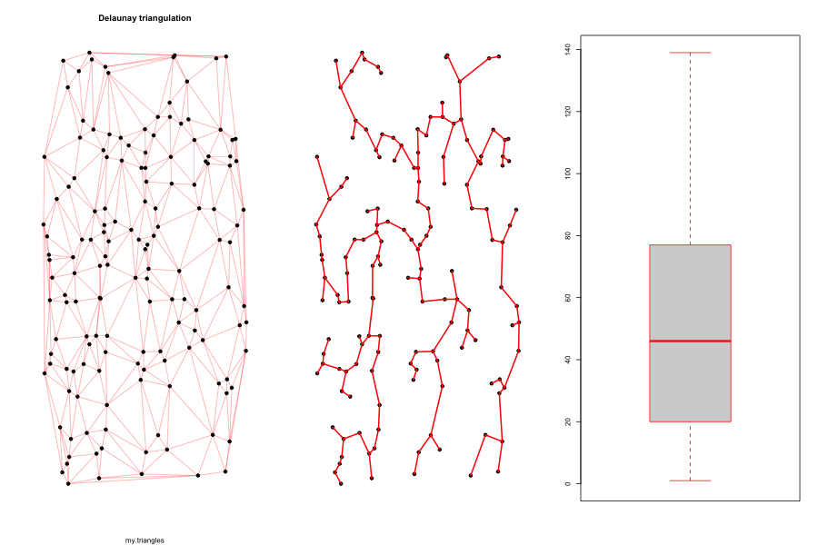
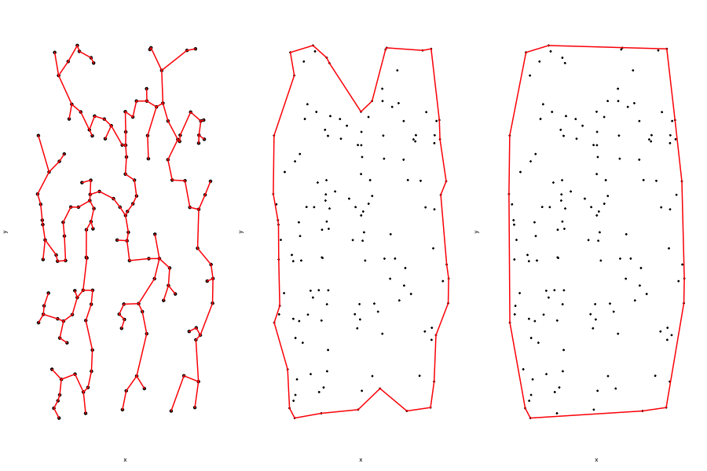

[](http://quantlet.de/)

## [](http://quantlet.de/) **Alpha_shapes** [](http://quantlet.de/)

```yaml

Name of QuantLet : Alpha_shapes

Published in : DEDA

Description : 'Alpha shape, convex hull, minimum spanning tree and Delaunay Triangulation of a simulated point cloud and the scatterplot of the CRIX and VCRIX.'

Keywords : 
- Alpha shape
- Minimum spanning trees
- Delaunay Triangulation
- Surface 
- point cloud
- CRIX
- VCRIX


Author : Jovanka Lili Matic 

Submitted : Tuesday, June 23 2020 by Jovanka Lili Matic

Example : 'Delaunay triangulation, minimum spanning tree, alpha shape and convex hull of a simulated point cloud and application on the CRIX and VCRIX scatterplot.'

```



